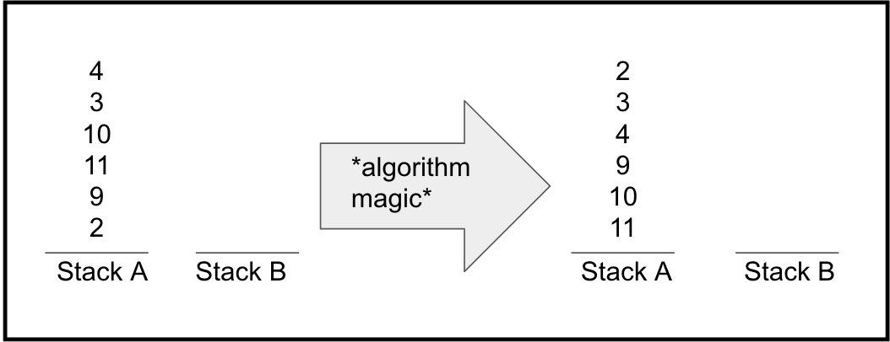

# push_swap
School 42 project: 2 stacks sorting problem

Summary:
This project will make you sort data on a stack, with a limited set of instructions, using
the lowest possible number of actions. To succeed you’ll have to manipulate various
types of algorithms and choose the one (of many) most appropriate solution for an
optimized data sorting.

**What this project is about:**  
  
[Image source and project explanation](https://medium.com/@jamierobertdawson/push-swap-the-least-amount-of-moves-with-two-stacks-d1e76a71789a)

**This implementation contains:**
- presorting by splitting stack A in 2 chunks consecutively
- best move evaluation
- 2 stacks shift
- Python vizualisation
- file reading

**What can be done:**
- change one-pointed shifts of 2 stacks by double-shift operations 
- better move evaluation

**How to use Python vizualisation:**  
./push_swap "filename or args squence" | python3 push_swap.py "filename or args squence"  
[]!(img/viz.png)

